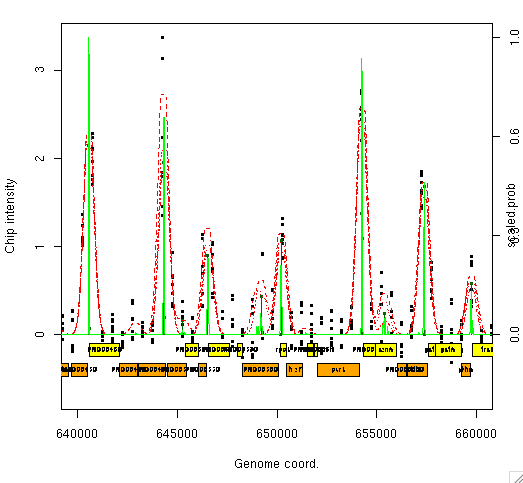

MeDiChI
=======

MeDiChI R package: Model-based deconvolution of genome-wide DNA binding

The MeDiChI Model-Based ChIP-chip Deconvolution Algorithm
This is the download and instruction page for the MeDiChI software in support of the Bioinformatics manuscript
"Model-based deconvolution of genome-wide DNA binding",
by David J Reiss, Marc T Facciotti, and Nitin S Baliga.

Please cite this publication if you utilize this package for your published research.

MeDiChI is method for the automated, model-based deconvolution of protein-DNA binding (Chromatin immunoprecipitation followed by hybridization to a genomic tiling microarray -- ChIP-chip) data that discovers DNA binding sites at high resolution (higher resolution than that of the tiling array itself). This enables more stringent analysis of the functional binding (including regulated genes and DNA binding motifs), than would be possible using standard procedures for enrichment detection. The procedure uses a generative model of protein-DNA binding sites, and a linear model of the cumulative effect of those sites on the intensity of microarray probes. It uses constrained linear regression and L1 shrinkage to estimate the parameters of the linear model, which correspond to the high-resolution locations and intensities of the binding peaks. Finally a bootstrap is used to estimate the uncertainties and significance of each binding site.
We have developed a MeDiChI R package (including all functions for analysis and visualization, and all novel data presented in the manuscript).

Here are some basic installation and usage instructions. For more extensive documentation on the package itself, see section 8, below. Please type help(INSTALL) or help(install.packages) in R for information on how to install (local or remote) packages in R.

1. Download and install R version 2.5.0 or later from CRAN (if not already installed).

2. The MeDiChI R package and its dependecies may now more easily be installed directly from github, using the devtools package, by typing, in R:

   ```
   install.packages( 'devtools', dep=T )
   install.packages( c( 'lars', 'quadprog', 'corpcor', 'Matrix' ), dep=T ) ## install MeDiChI dependencies
   library( devtools )
   install_github( 'MeDiChI', 'dreiss-isb', subdir='lars.pos' ) ## install the custom positive-only lars package
   install_github( 'MeDiChI', 'dreiss-isb', subdir='MeDiChI' )
   ```

3. As of version 0.3.3, MeDiChI has been experimentally parallelized so that it can utilize all cores or processors on a multi-core UNIX computer for deconvolution of a large (genome-wide) data set. This will require the additional installation of the [multicore](http://www.rforge.net/multicore/) and [doMC](http://cran.r-project.org/web/packages/doMC) packages, and should work with no additional required configuration. (However, multicore does not seem to work correctly on Windows systems. This will hopefully be remedied soon.)

4. For more extensive MeDiChI documentation, see section 8, below. You can also take a look at the MeDiChI [package vignette](MeDiChI/inst/doc/MeDiChI.pdf).

5. Start R, and enter the following at the R prompt (this will load the low-resolution HaloSpan data, run the MeDiChI deconvolution on a section of it with 10 bootstraps, and visualize the results similar to the top of Figure 3 in the manuscript):

```
library(MeDiChI) ## loads the MeDiChI library
data("halo.lowres", package="MeDiChI") ## loads the data into memory

fit <- chip.deconv(data.halo.lowres, where="Chr", fit.res=10, center=650000, wind=20000, max.steps=100, n.boot=10, kernel=kernel.halo.lowres, verbose=T, boot.sample.opt="case")

print(coef(fit))
plot(fit, plot.genes=T, cex=0.5, cex.lab=0.8, cex.axis=0.8 )
```

6. Alternatively, typing 

```
demo(MeDiChI) 
```

will perform steps 2-5 (above) for you.

7. You should shortly see a plot appear, something like the one below: 



8. For more extensive MeDiChI package documentation, from within R, type:

```
library(MeDiChI) ## loads the MeDiChI library

help("MeDiChI") ## library overview -- see the "See Also" section for a list of all functions for which documentation exists (e.g. "help(chip.deconv)" describes the format required for the input data).

help("MeDiChI-data") ## describes the included data
```

9. You can also take a look at the MeDiChI (package vignette)[MeDiChI/inst/doc/MeDiChI.pdf].

This is MeDiChI version 0.4.1.
